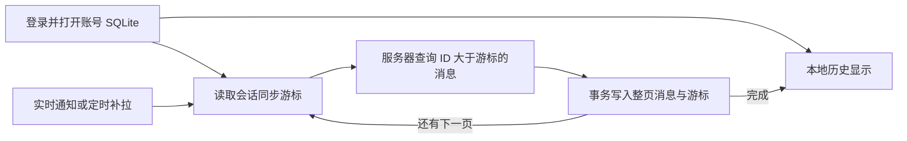

# 本地消息存储与增量同步

## 目标和数据边界

服务器已提交的消息是权威记录。本地已经同步确认的历史持续保留，后续上线只请求同步游标之后的新增消息，不清空重拉。当前合同针对已有私聊消息；没有新增编辑、撤回或删除同步协议。

客户端复用账号目录：`data/environments/<环境SHA256>/users/<uid>/messages.sqlite`。
附件保存原始资源描述符，下载文件仍由现有资源模块管理。SQLite 不是服务端 MySQL 的替代品。

## 工作流程

1. 登录成功后，`MessageService` 在专属线程打开账号 SQLite；通过现有会话列表分页发现全部会话。
2. 界面先从本地读取最新 50 条，上翻继续读取本地更早记录。
3. 每个会话以持久化 `cursor` 请求 `1027/sync_v1`，首次游标为 0；服务端按 ID 升序返回最多 50 条。
4. 本地在一个事务中合并整页消息并推进游标。任一写入或身份校验失败均不推进游标。
5. `load_more=true` 时继续拉取；全部完成后刷新已显示的消息区间，避免一次新增超过 50 条造成显示缺口。
6. 实时通知触发补拉；已发现会话每 30 秒补拉一次。发送 ACK 和实时推送均不能推进同步游标。
7. 退出或切换账号按顺序排空已接受的写入并关闭连接；旧账号回调由代际标识丢弃，不删除消息。

## 一致性与恢复

- 服务端复用 migration 002 的 `UNIQUE(send_id, client_msg_uuid)`，文本和附件共享身份约束。
- 文本提交、资源提交和同步查询都先锁定同一 `private_chat` 会话行。由此避免较小 ID 尚未提交时，同步游标越过它。此保证要求所有 ChatServer 写入方都已更新。
- SQLite schema 1 包含 `messages` 与 `sync_state`，以服务端 ID 和发送者/UUID 去重；已确认的本地历史不被重复覆盖。
- UUID 对应的服务器 ID、会话或收件人冲突会回滚同步页，不能静默丢弃消息后推进游标。
- 发送先写本地再交给现有 TCP 发送链路。重启后未确认记录成为“待核实”；可双击按原 UUID 重试。保留 develop 已有的同进程重连原始报文重试机制。
- 服务端提交成功后即使接收者离线也保留成功 ACK。SQLite ACK 合并只更新消息状态，不推进游标。
- SQLite 使用 WAL、FULL 同步、有界忙等待和账号锁。工作线程最多接受 256 个普通待完成操作；切换账号的打开/关闭操作按顺序执行，不因旧账号队列满而丢失。
- 不自动删除损坏数据库或高于当前版本的数据库；错误向界面报告。事务对象不可复制，回滚失败关闭连接。

## 协议和部署

字段与传输限制见 [Protocol](Protocol.md#incremental-private-message-synchronization-sync_v1)。
只有响应 1028 可以使用完整 uint16 包长（65535 字节）；其余消息和客户端请求仍为 2048 字节。
旧历史请求保留原有字段、分页和错误回包。新客户端不能把旧服务端的历史响应当作同步成功。

本次相对最新 develop **没有新增 MySQL 迁移**。使用已有 [schema 迁移入口](Data.md#operational-entry) 确保现有 001～003 已应用；不创建旧工作区方案中的 `text_message_identity` 表。
升级时停止全部 ChatServer 写入，更新所有实例，再部署客户端，避免旧写入方破坏游标顺序保证。
客户端首次打开时自行创建 SQLite schema；部署需要 Qt SQL 和 QSQLITE 插件，见 [Build](Build.md#message-storage-runtime)。

## 验证与复核

- [Qt 存储回归](../chat/tests/message-storage/README.md)：重启游标、ACK 合并、身份冲突回滚、账号隔离、本地分页、队列满后切换账号、落盘失败禁止发送及大批增量刷新。
- [服务端同步回归](../tests/server/message-sync/README.md)：真实 MySQL、文本/附件共享 UUID、事务回滚、提交锁顺序、双 ChatServer 增量同步与 Qt/SQLite 进程重启。
- 既有网络解码和 MsgNode 测试覆盖响应 1028 的扩展上限及其他消息的原上限。

静态复核分需求与规范两条线：修复了身份冲突漏消息、队列满时账号打开被拒绝、旧历史错误回包丢失，以及事务复制/回滚处理问题。测试使用临时 MySQL；未迁移个人运行库，也不把替身 Status/Redis 或无界面探针记为完整桌面端到端验收。
