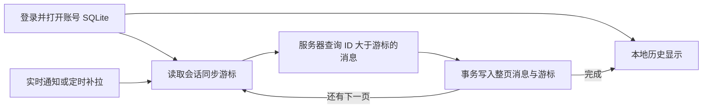

# 本地消息存储与增量同步

## 目标和数据边界

服务器已提交的消息是权威记录。本地已经同步确认的历史持续保留，后续上线只请求同步游标之后的新增消息，不清空重拉。当前合同覆盖私聊和动态群聊；没有新增编辑、撤回或删除同步协议。

群文字及资源消息复用此链路。群目录先落盘，群消息使用 `recipient_id=0`，本地仅在目录确认是群时
允许该值。SQLite 当前为 schema 4，群版本、状态、代次、边界及待确认管理命令保存在会话目录 JSON。群每 2 秒补拉，不生成私聊送达/已读回执；
退出账号停止轮询。服务端群写入和同步锁同一 `group_chat` 行，保留游标不越过未提交消息的保证。
范围及部署见 [基础群聊协议](Protocol.md#基础文字群聊)。

客户端复用账号目录：`data/environments/<环境SHA256>/users/<uid>/messages.sqlite`。
附件保存原始资源描述符，下载文件仍由现有资源模块管理。SQLite 不是服务端 MySQL 的替代品。

## 工作流程

1. 登录成功后，`MessageService` 在专属线程打开账号 SQLite；通过现有会话列表分页发现全部会话。
2. 界面先从本地读取最新 50 条，上翻继续读取本地更早记录。
3. 每个会话以持久化 `cursor` 请求 `1027/sync_v1`，首次游标为 0；服务端按 ID 升序返回最多 50 条。
4. 本地在一个事务中合并整页消息并推进游标。任一写入或身份校验失败均不推进游标。
5. `load_more=true` 时继续拉取；全部完成后刷新已显示的消息区间，避免一次新增超过 50 条造成显示缺口。
6. 实时通知触发补拉；已发现会话每 30 秒补拉一次。发送 ACK 和实时推送均不能推进同步游标。
7. 退出或切换账号按顺序排空已接受的写入并关闭连接；旧账号回调由代际标识丢弃，不删除消息。

```mermaid
flowchart LR
    A[登录并打开账号 SQLite] --> B[本地历史显示]
    A --> C[读取会话同步游标]
    C --> D[服务器查询 ID 大于游标的消息]
    D --> E[事务写入整页消息与游标]
    E -->|还有下一页| C
    E -->|完成| B
    F[实时通知或定时补拉] --> C
```

## 一致性与恢复

- 服务端复用 migration 002 的 `UNIQUE(send_id, client_msg_uuid)`，文本和附件共享身份约束。
- 文本提交、资源提交和同步查询都先锁定同一 `private_chat` 会话行。由此避免较小 ID 尚未提交时，同步游标越过它。此保证要求所有 ChatServer 写入方都已更新。
- SQLite schema 2 保留 `messages` 与 `sync_state`，增加持久化发送 outbox、回执、回执 outbox 和独立 revision 游标；以服务端 ID 和发送者/UUID 去重。升级 schema 1 前保留 SQLite 快照，详见 [消息状态](MessageStates.md)。
- UUID 对应的服务器 ID、会话或收件人冲突会回滚同步页，不能静默丢弃消息后推进游标。
- MessageService 在发送前同事务保存正文及原始批次；认证后先同步核实，再按原 UUID/内容和递增 attempt 有界重试。显式退出暂停自动发送，双击可恢复。TcpMgr 不再维护业务重试队列。
- 服务端提交成功后即使接收者离线也保留成功 ACK。SQLite ACK 合并只更新消息状态，不推进游标。
- SQLite 使用 WAL、FULL 同步、有界忙等待和账号锁。工作线程最多接受 256 个普通待完成操作；切换账号的打开/关闭操作按顺序执行，不因旧账号队列满而丢失。
- 不自动删除损坏数据库或高于当前版本的数据库；错误向界面报告。事务对象不可复制，回滚失败关闭连接。

## 协议和部署

字段与传输限制见 [Protocol](Protocol.md#incremental-private-message-synchronization-sync_v1)。
只有响应 1028 可以使用完整 uint16 包长（65535 字节）；其余消息和客户端请求仍为 2048 字节。
旧历史对象请求保留原有字段、分页和错误回包；顶层非对象请求由认证分发器拒绝处理。新客户端不能把旧服务端的历史响应当作同步成功。

消息状态实现新增 MySQL migration 004（回执及会话 revision），使用 [schema 迁移入口](Data.md#operational-entry) 应用 001～006（005 为基础群聊，006 为动态成员资格）。Gate、Chat 和 Resource 的 schema 校验合同一同更新；不创建 `text_message_identity` 表。
升级时停止写入并备份数据库，迁移后更新全部 Gate/Chat/Resource 实例，再部署客户端；旧二进制不能混跑新 schema。
客户端首次打开时自行创建 SQLite schema；部署需要 Qt SQL 和 QSQLITE 插件，见 [Build](Build.md#message-storage-runtime)。

## 验证与复核

- [Qt 存储回归](../chat/tests/message-storage/README.md)：重启游标、ACK 合并、身份冲突回滚、账号隔离、本地分页、队列满后切换账号、落盘失败禁止发送及大批增量刷新。
- [服务端同步回归](../tests/server/message-sync/README.md)：真实 MySQL、文本/附件共享 UUID、事务回滚、提交锁顺序、双 ChatServer 增量同步与 Qt/SQLite 进程重启。
- 既有网络解码和 MsgNode 测试覆盖响应 1028 的扩展上限及其他消息的原上限。

静态复核分需求与规范两条线：修复了身份冲突漏消息、队列满时账号打开被拒绝、旧历史错误回包丢失，以及事务复制/回滚处理问题。测试使用临时 MySQL；未迁移个人运行库，也不把替身 Status/Redis 或无界面探针记为完整桌面端到端验收。

发送、送达、阅读证据与新回执协议见 [MessageStates](MessageStates.md)。

## 本地会话与联系人目录

账号 `messages.sqlite` 的 schema 3 新增 `contacts`、`conversations`、`applications`。
各表以 UID 或 chat ID 为主键，保存现有展示字段的 JSON 值；界面对象和令牌不入库。
升级 schema 1/2/3 前保留对应版本快照，原消息、回执、发送批次及同步游标不变。

- 登录认证后，原存储工作线程先恢复本地目录，再合并本次登录响应；UserMgr 只缓存本地返回值。
- 联系人及会话列表按 ID 升序从 SQLite 每次读取 13 条，界面游标与网络游标独立。
  已显示条目按 ID 更新；新记录仍可继续分页，已加载完整列表自动补读新增记录。
- 网络仍使用现有登录好友/申请列表和会话分页；它们按主键事务合并，不新增目录 revision 协议。
  缺失记录不视为删除。好友审批把联系人、会话和已有申请状态放在同一事务中提交。
- 网络业务完成通知在目录落盘后发出，写入失败不发布新目录；旧账号回调沿用代际隔离。
- 消息正文与同步机制、头像文件存储、列表样式和未读规则保持原有职责。
  此功能不提供离线登录，也不宣称目录网络传输已改为增量同步。

验证入口沿用 `message_storage.persistence` 和 `session_reset.account_state`，覆盖目录重启、
三页以上分页、重复更新、事务回滚、审批状态、版本升级及切换账号隔离。

## 动态成员资格与本地查找

schema 3→4 升级前保留快照，原消息、回执、outbox 和游标保留。
群目录单调合并版本；离群/解散停止正文同步、禁用输入并暂停旧代次 outbox，
已经发出但未确认的消息保留不确定状态，不冒充发送失败。重新加入只同步新边界之后消息，
迟到的旧代次响应不能写入新成员期间。服务端成功但 SQLite 失败时保留待确认命令并报告本地保存错误。

联系人/群查找遍历当前账号全部 SQLite 目录后分页，按名称、个人备注或 ID 过滤。
当前会话历史搜索匹配本地文本和资源文件名，每页 50 条，按本地 ID 倒序继续，
双击结果加载并定位对应历史；不访问服务端全文索引，不搜索尚未同步的历史。
